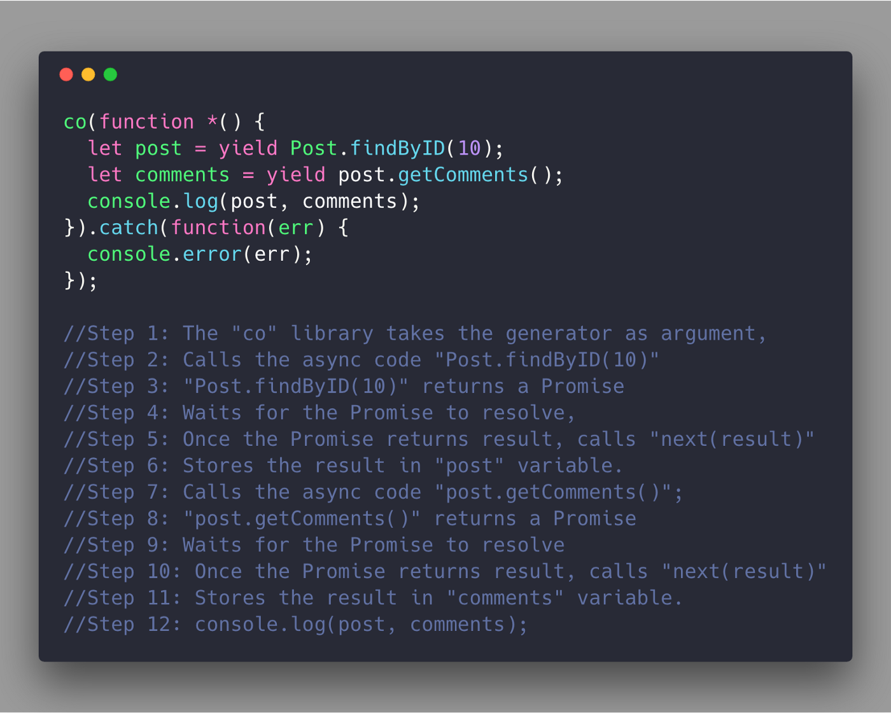

# generator

> Notice unlike a normal function, the generator function can yield (store the function’s state and return value) and also be ready to take additional input values at the point where it yielded.

input->output->input->output...

;

EXAMPLE1: 产出 接受数据 保存状态
```javascript
function *generator(a, b) {
    let k = yield a + b;
    let m = yield a + b + k;
    yield a + b + k + m;
}

const generatorObj = generator(1,2);
console.log(generatorObj.next()); // 3
console.log(generatorObj.next(3)); // 6
console.log(generatorObj.next(6)); // 12
console.log(generatorObj.next()); // undefined done: true
```

## Sending values back-and-forth to generators via the “next” method

通过next方法传递值到生成器。这个特征使得生成器可以消除回调地域。

## CO

;