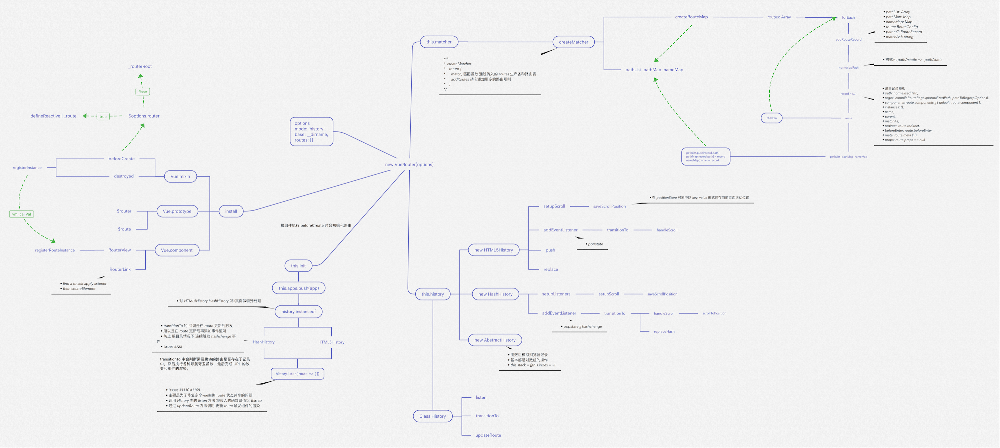

# router

## SPA & 前端路由

> SPA 通过动态重写当前页面来与用户交互，而非传统的从服务器重新加载整个页面。

### SPA & 浏览器历史记录

整个应用只有一个页面，看起来的多页面是由JS操作来完成的。因此在操纵浏览器的历史记录时（比如回退），可能返回的真正的上一个页面，而不是用户期望的SPA应用中的上个页面。

因此需要用到前端路由。

前端路由：通过JS操纵浏览器的会话历史。

### Frontend Routing

- hash mode
- history mode

#### hash mode

hash: URL中`#`及之后的内容

hash值的变化，不会重新向服务器发送请求；会触发hashchange事件(浏览器前进/后退，window.location.hash = 'xxx')，可以在事件处理程序中做一些操作。

```javascript
// url: http://growth-material.corp.kuaishou.com/#/agentManagement
window.location.hash = '#/agentManagement';
```

一个例子：`window.location.hash`重新赋值会修改浏览器的会话记录。

```javascript
// https://fanyi.baidu.com/
// window.location.hash = '#/aaa' 地址栏变成 https://fanyi.baidu.com/#/aaa
// window.location.hash = '#/bbb' 地址栏变成 https://fanyi.baidu.com/#/bbb

// 操作浏览器的后退按钮，地址栏变成 https://fanyi.baidu.com/#/aaa
// 操作浏览器的后退按钮 地址栏变成 https://fanyi.baidu.com

// 操作浏览器的前进按钮 地址栏变成 https://fanyi.baidu.com/#/aaa
```

### history mode

HTML5提供了操纵浏览器会话记录的API `pushState` `replaceState`

`popstate`事件可以监听浏览器的前进、后退操作；以及`history.back()` `history.forward()` `history.go()`

**path的切换会向服务器发起请求，所以history模式下，需要在nginx层（或web服务器层）做配置（统一都返回index.html），否则可能会出现404**

## Vue-Router


*vue router 整体架构*

### 行为层

#### 用户行为

点击页面中的link标签、点击手动调用push/replace API ，最终都会触发transitionTo，找到匹配的route，执行完所有的导航守卫、完成route的更新之后，会调用**pushHash**或者**pushState**完成会话记录的更新。(pushHash方法中，如果browser支持pushState，则会调用pushState完成会话记录的添加；不支持的话，会直接修改window.location.hash<会话记录会相应改变>).

#### 浏览器行为

点击浏览器的前进后退按钮、或者通过history API（back、forward、go）操作会话历史，则会触发popstate事件或者hashchange事件，通过注册的事件处理函数调用transitionTo()完成路由的匹配及更新。

==push()中通过window.location.hash = XXX的方式更新hash值，会触发hashchange事件。代码中监听的hashchange事件，其处理函数中又会调用transitionTo()做路由切换，不会有问题吗？==

transitionTo中调用confirmTransition中会对相同路由做判断。

### 响应式

#### 派发更新

==vmRoot._route = route; vmRoot._route setter trigger==

transitionTo()完成路由的匹配、导航守卫等操作后，会updateRoute
	在updateRoute中，首先会修改history.current；其次调用history.cb(route);
		history.cb是在router init的时候，调用history.listen(cb)完成赋值的。
			cb = (route) > { 遍历router.apps, 更改app._route = route }
	updateRoute之后，vueRootInstance._route更新；
	beforeCreate()中，对vueRootInstance._route做了响应式处理，setter触发后，对应的依赖watcher会更新（包括router-view组件，重新根据当前的route，匹配需要渲染的组件，完成派发更新）

#### 依赖收集

**summary**

vmRoot._route 响应式

vmInstance.$route -> vmRoot._route

Router-View Component -> render fn (get vmInstance.$route) -> vmRoot._route(对router-view render watcher add dep)

**detail**

install

Object.defineProperty(Vue.prototype, '$route', {
    get() { return this._routerRoot._route }; // this._routerRoot 根Vue实例
});

Vue.mixin(
    beforeCreate() {
        ...
        Vue.util.defineReactive(this, '_route', this._router.history.current); // 对vmRoot._route做了响应式处理
    }
)

Router-View Component

const route = parent.$route; // 读取了vmRoot._route，所以对Router-View Component render watcher做了依赖收集。


```javascript
history.confirmTransition(route, onComplete, onAbort) {
    ...
    onComplete();
}

function onComplete() {
    const prev = this.current
    this.updateRoute(route)
    // ...
}

function updateRoute(route) {
    history.current = route;
    history.cb && history.cb(route); // app._route = route  _route setter
}

// 关于history.cb
// class history
listen(cb) {
    this.cb = cb;
}

// class Router
init(app) {
    history.listen(route => {
        this.apps.forEach(app => {
            app._route = route;
        })
    })
}

router.history.cb = route => {
    router.apps.forEach(app => {
        app._route = route;
    })
}
```

### three class

- router
- history
- matcher

#### class Router

```javascript
class Router {
    constructor(options) {
        this.app = null;
        this.apps = [];
        this.beforeHooks = [];
        this.afterHooks = [];
        this.resolveHooks = [];

        // this.matcher = { match: fn, addRoutes: fn}
        this.matcher = createMatcher(options.routes || [], this);

        // 根据options.mode 创建不同的history instance
        switch(mode) {
            case 'history':
                this.history = new HTML5History(this, options.base);
            case 'hash':
                this.history = new HashHistory(this, options.base, this.fallback);
            case 'abstract':
                this.history = new AbstractHistory(this, options.base);
        }
    }

    // VueRouter.install时，在Vue的每一个组件中都混入了beforeCreate钩子函数，当vm为根组件实例时，会调用this._router.app(this);
    init(app) {
        this.apps.push(app);
        this.app = app;

        // 首次route匹配、跳转
        // setupListeners = () => { this.history.setupListeners(); // ...} 添加事件监听 popstate or hashchange
        this.history.transitionTo(
            history.getCurrentLocation,
            setupListeners, // onComplete
            setupListeners // onAbort
        );

        // this.history.cb = cb 会在transitionTo -> confirmTransition -> 之后调用
        this.history.listen(route => {
            this.apps.forEach(app => {
                app_route = route; // setter 派发更新
            })
        })

    }
}
```

#### class History


```javascript
class History {
    constructor() {}

    transitionTo(location, onComplete, onAbort) {
        const route = this.router.match(location, this.current); // 匹配要跳转的路由
        this.confirmTransition(
            route,
            // success cb
            () => {
                // ...
            },
            // fail cb
            () => {
                // ...
            }
        )
    }

    // 确认切换
    confirmTransition(route, onComplete, onAbort) {
        isSameRoute(route, current) && return;

        // 解析出更新的、失活的、激活的RouteRecord
        const { updated, deactivated, activated } = resolveQueue(this.current.matched, route.matched);

        // queue 导航守卫数组
        const queue: Array<?NavigationGuard> = [].concat(
            extractLeaveGuards(deactivated), // 获取所有失活的组件定义的beforeRouteLeave钩子函数
            this.router.beforeHooks, // 全局的beforeEach钩子 全局导航守卫
            extractUpdateHooks(updated), // 路由改变，组件复用时调用beforeRouteUpdate钩子
            activated.map(m => m.beforeEnter), // 需要渲染组件的beforeEnter守卫钩子 路由独享守卫
            resolveAsyncComponents(activated) // 解析异步路由组件
        );

        // 定义迭代器
        const iterator = (hook, next) => {
            hook(route, current, (to) => {
                // ...
                next(to)
            });
        };

        runQueue(queue, iterator, () => {
            // ...
        })
    }
}

// execute queue && 执行完成之后，调用cb
function runQueue(queue:Array<?NavigationGuard>, fn, cb) {
    const step = index => {
        // queue execute done
        if (index >= queue.length) {
            cb();
        } else [
            // hook exist
            if (queue[index]) {
                // iterator(hook, next), 因此必须执行next，才会执行下一步。
                fn(queue[index], () => {
                    step(index + 1);
                });
            } else {
                step(index + 1)
            }
        ]
    }
    step(0);
}
```


#### class Matcher


## todo
- [ ] route.matched


