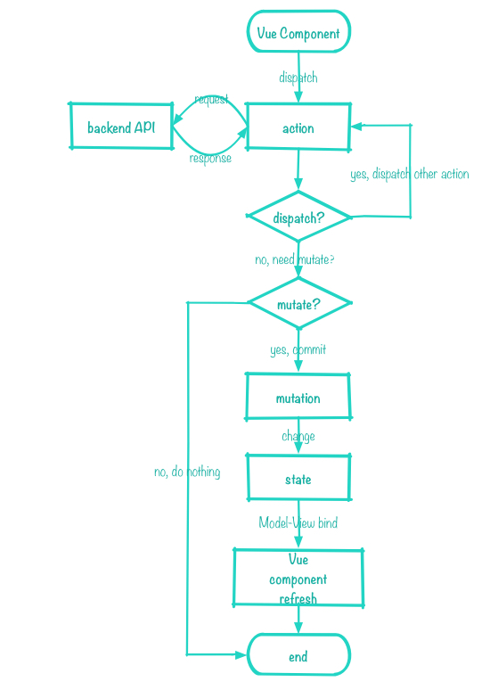
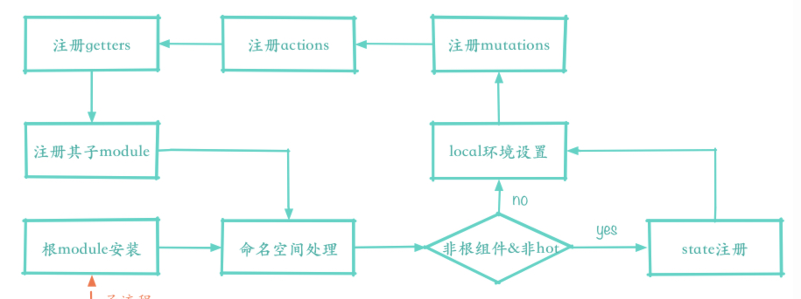

# vuex

## `install`

==每一个Vue组件都是如何获取到store对象的:==

`Vue.mixin`将`beforeCreate`混入到每一个VueComponent中

在`beforeCreate`中，对vmInstance.$store做了赋值。
- 根vm实例，直接读取this.$options.store
- 组件实例，获取`this.$options.parent.$store`。保证层层递进，每一个组件都可以通过$store获取到store

## `new Vuex.Store(options)`




### some property

`this._actions` 保存了action type与handler数组的对象
	调用dispatch(type, payload)时，会从this._actions[type]中获取要执行的handler。

`this._mutations` 保存了mutation type与对应handler数组关系的对象
	调用commit(type, payload), 会从this._mutations[type]中获取要执行的handler。

`this._wrappedGetters` 保存了getter type与handler fn关系的对象  与store._vm的computed构建有关。

### build module tree

通过递归调用`ModuleCollection.prototype.register(path, rawModule, runtime)`构建模块树。
- 每一个options(传入new Vuex.Store()中的，或者modules中对应的对象)都会初始化成一个Module实例，_children属性	中保存了子module实例。


```javascript
this._modules = new ModuleCollection(options);

// 结构
this._modules = {
    root<Module>: {
        state: Object,
        _children: {
            moduleNamespace: ModuleInstance<Module>
        },
        _rawModule: {
            state: {},
            mutations: {},
            actions: {},
            getters: {},
            ...
        }
    }
}
```

### `commit` `dispatch`

绑定`commit` `dispatch` 方法的this指向。防止在组件中通过`this.$store.commit/dispatch`时，`this`指向Vue instance

### 安装模块

`installModule(this, state, [], this._modules.root)`



完成这些构建
`store.state`
`module.context`
`store._mutations`
`store._actions`
`store._wrappedGetters`

- store._modulesNamespaceMap存储namespace: module键值对

- 模块下的state，通过命名空间挂载到store.state对应的节点上。

- 生成module.context = makeLocalContext(store, namespace, path)

- 注册mutations ->  store._mutations  eg: store._mutations.moduleName/mutationsName

- 注册actions -> store._actions eg: store._actions.moduleName/actionName 调用的时候，传递了local参数，所以可以获取到local.commit\dispatch等参数。 

- 注册getters -> store._wrappedGetters

- 递归调用installModule注册子module

### state 修改方法 _withCommit